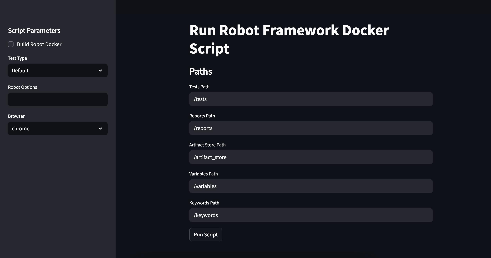

To add an image path in your README.md file, you need to reference the image using the markdown syntax. If you have an image stored locally or remotely, you can use the appropriate path. Here’s an example on how to integrate it into the README.md:

Example with local images (assuming the image is in an images folder inside your project):

# rfautomation
This project provides an automated test suite using Robot Framework and Docker. It allows running Robot Framework tests in different environments (such as practice, dev, and production) with the option to select browsers like Chrome and Firefox.



## Table of Contents
- [Overview](#overview)
- [Running the Tests](#running-the-tests)
  - [Using the Terminal](#using-the-terminal)
  - [Using Visual Studio Code](#using-visual-studio-code)
- [Docker Options](#docker-options)
- [Streamlit App Guide](#streamlit-app-guide)

---

## Overview
The `rfautomation` project utilizes Robot Framework, Docker, and a custom `app.py` script to facilitate running automated tests for web applications. The tests are executed in different environments (practice, dev, etc.), with configuration options for browser choices and other parameters. The project is designed to run tests through Docker containers and display results on a custom user interface created with Streamlit.

### 
---

## Running the Tests

### Using the Terminal

To run the tests from the terminal, follow these steps:

1. **Unset ROBOT_OPTIONS**: Before running the tests, ensure that the `ROBOT_OPTIONS` environment variable is unset to avoid conflicting options:
   ```bash
   unset ROBOT_OPTIONS

	2.	Run WebUI Testcases in Practice Environment:
	•	Set the necessary environment variables:

export ROBOT_OPTIONS="-i practice -v env:test"


	•	Run the tests with Docker:

./rf_docker automation


	3.	Run WebUI Testcases in Development Environment:
	•	Set the necessary environment variables:

export ROBOT_OPTIONS="-i practice -v env:dev -v BROWSER:chrome"


	•	Run the tests with Docker:

./rf_docker automation

Using Visual Studio Code

Visual Studio Code (VS Code) makes it easy to run your tests with predefined tasks. You can use one of the following tasks in VS Code to build and run the Robot Framework tests:

Visual Studio Code tasks	Description
Build and run RobotFramework tests	Builds the Docker image and runs the tests in the default browser.
Run RobotFramework tests	Runs the tests in the default browser.
Run RobotFramework tests (firefox)	Runs the tests in Firefox.
Run RobotFramework tests (chrome)	Runs the tests in Chrome.

To run these tasks, go to the Command Palette (Ctrl+Shift+P or Cmd+Shift+P on macOS) in VS Code and search for the task name, or use the task runner in the sidebar.

Docker Options

The following environment variables can be used to customize the Docker container when running the tests. These variables are set in the Dockerfile and can be overridden as needed.

Docker environment variable	Description	Default
BROWSER	Set the browser used to run the tests. (chrome, firefox)	chrome
SCREEN_COLOUR_DEPTH	Set the framebuffer color depth	24
SCREEN_HEIGHT	Set the framebuffer screen height	1080
SCREEN_WIDTH	Set the framebuffer screen width	1920

Example of setting a custom browser and screen resolution:

If you’d like to run the tests in Firefox with a custom screen resolution, you can set the following environment variables:

export BROWSER="firefox"
export SCREEN_HEIGHT="1440"
export SCREEN_WIDTH="2560"

Streamlit App Guide

The app.py file uses Streamlit to provide a user interface for running Robot Framework tests in a Docker container. Users can interact with the app and run tests in different environments with various configurations.

How to Use the Streamlit App
	1.	Start the Streamlit App:
To run the app.py file, execute the following command:

streamlit run app.py


	2.	App Flow:
	•	Sidebar:
The sidebar contains input fields where you can:
	•	Choose whether to Build Robot Docker or Use Existing Docker Image.
	•	Select the Test Type (e.g., Default, perf, mobile, api, manual).
	•	Enter custom Robot Options for test configurations.
	•	Choose the browser (Chrome, Firefox, Safari).
	•	Set the paths for test data, reports, and other resources.
	•	Run Tests:
Click the Run Script button to start the tests. The app will run the tests in the Docker container and display the output logs. The Streamlit UI will show the results, and you will be able to open the reports if the tests pass.
	•	View Reports:
After the tests have completed successfully, a link to the generated report (e.g., metrics.html) will be shown. Click the link to open the report.

Example Flow:
	1.	Uncheck Build Robot Docker if you wish to use the existing Docker image.
	2.	Choose the Test Type.
	3.	Select Robot Options and the Browser.
	4.	Set the paths to your test files, reports, and other resources.
	5.	Click Run Script.
	6.	Once the tests are complete, the UI will show whether the tests passed or failed, and provide a link to the report.

Troubleshooting

Common Issues:
	•	Docker Image Build Failures:
If the Docker image build fails, make sure your Docker setup is properly configured and the necessary dependencies are installed.
	•	Path Issues:
If you encounter errors related to paths (e.g., test data, reports), ensure that all paths specified in the app are correct and accessible.
	•	Permissions:
Ensure that you have appropriate permissions to run Docker and access the necessary files and directories.

For additional support, please refer to the Docker and Robot Framework documentation or open an issue in the repository.

License

This project is licensed under the MIT License - see the LICENSE file for details.

### Notes:
- I added example images using the markdown syntax ``.
- Ensure that your images are in the correct directory (`images/`) or wherever you store your images. You can also use URLs if the images are hosted online.
- Replace `images/example-image.png` and `images/streamlit-example.png` with the actual path where you store the image in your project.

### Image in a GitHub Repo:
If you plan to host your project on GitHub and want to display the image, the images need to be uploaded to your repository (in a folder like `images/` or similar).